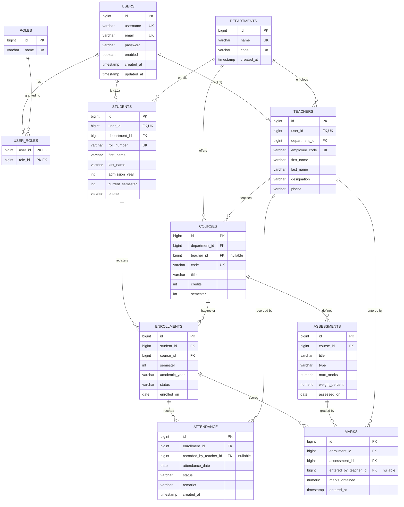

# PHASE 1 — DATABASE & ARCHITECTURE

**Group 8 — Student Academic Records & Attendance Management System**
Prerequisite: Phase 0 approved (11-entity model approved by the team).
Status: **DESIGN ONLY — NO CODE WRITTEN.** Awaiting approval to enter Phase 2.

---

## 0. Objective, inputs, outputs

**Objective:** produce a complete, verifiable database and architecture design so that
Phase 2 can be implemented mechanically, with no design decisions left open.

**This phase delivers:**
1. ERD
2. Table-by-table design with every column, type, nullability, key and constraint
3. Constraint and index catalogue
4. JPA entity/relationship map with the exact annotations to be used
5. Enum and reference-data definitions
6. Finalized backend package structure with the file inventory
7. Complete endpoint-by-endpoint API contract with status codes and authorization
8. DTO inventory
9. Seed-data plan
10. Verification plan for Phase 2

**Provisional settings carried from Phase 0** (none affect the schema; each lives in one
place and can be changed in a single line):

| Setting | Value | Where it lives |
|---|---|---|
| Grade scale | A+ ≥90, A ≥80, B ≥70, C ≥60, D ≥50, F <50 | `util/GradeUtil.java` |
| Grade points | 4.0 / 3.7 / 3.3 / 2.7 / 2.0 / 0.0 | `util/GradeUtil.java` |
| Low-attendance threshold | 75% | `application.yml` → `app.attendance.threshold` |
| LATE counts as present | yes | `util/AttendanceUtil.java` |
| Base package | `com.group6.sams` | project-wide |
| Pass mark | 50% (grade ≠ F) | `util/GradeUtil.java` |

---

## 1. ERD



**Reading the diagram — the three structural decisions:**

1. `USERS ||--o| STUDENTS` / `TEACHERS` — a user account is optional-to-one profile. A
   user is *either* a student *or* a teacher *or* an admin with neither profile. We do not
   model this as inheritance; two nullable-side 1:1s keep the tables clean and avoid
   single-table nulls or join-table inheritance complexity.

2. `ENROLLMENTS` resolves the many-to-many between students and courses **and carries its
   own data** (semester, academic year, status). That is why it is an entity rather than
   a join table.

3. `ATTENDANCE` and `MARKS` attach to `ENROLLMENTS`, never to `(student, course)` pairs.
   This makes "attendance for a student not enrolled in the course" structurally
   impossible — the foreign key alone enforces it.

---

## 2. Table Design

Conventions: `BIGSERIAL` surrogate primary keys; `snake_case` identifiers; enums stored
as `VARCHAR` with `CHECK` constraints (matching JPA `@Enumerated(EnumType.STRING)` — never
`ORDINAL`, because ordinal values break the moment someone reorders the Java enum);
timestamps as `TIMESTAMP`.

### 2.1 `users`

| Column | Type | Null | Key | Notes |
|---|---|---|---|---|
| id | BIGSERIAL | NO | PK | |
| username | VARCHAR(50) | NO | UK | login identifier |
| email | VARCHAR(120) | NO | UK | |
| password | VARCHAR(100) | NO | | BCrypt hash, ~60 chars |
| enabled | BOOLEAN | NO | | default TRUE |
| created_at | TIMESTAMP | NO | | default NOW() |
| updated_at | TIMESTAMP | YES | | |

The `password` column never leaves the backend. No response DTO contains it.

### 2.2 `roles`

| Column | Type | Null | Key | Notes |
|---|---|---|---|---|
| id | BIGSERIAL | NO | PK | |
| name | VARCHAR(30) | NO | UK | CHECK IN (ROLE_ADMIN, ROLE_TEACHER, ROLE_STUDENT, ROLE_USER) |

Reference data — four rows, inserted by the seeder, never edited through the API.

### 2.3 `user_roles`

| Column | Type | Null | Key | Notes |
|---|---|---|---|---|
| user_id | BIGINT | NO | PK, FK→users | ON DELETE CASCADE |
| role_id | BIGINT | NO | PK, FK→roles | ON DELETE RESTRICT |

Composite primary key `(user_id, role_id)` — this alone prevents granting the same role
twice.

### 2.4 `departments`

| Column | Type | Null | Key | Notes |
|---|---|---|---|---|
| id | BIGSERIAL | NO | PK | |
| name | VARCHAR(100) | NO | UK | e.g. "Computer Science" |
| code | VARCHAR(10) | NO | UK | e.g. "CS" |
| created_at | TIMESTAMP | NO | | default NOW() |

### 2.5 `students`

| Column | Type | Null | Key | Notes |
|---|---|---|---|---|
| id | BIGSERIAL | NO | PK | |
| user_id | BIGINT | NO | UK, FK→users | 1:1; ON DELETE RESTRICT |
| department_id | BIGINT | NO | FK→departments | ON DELETE RESTRICT |
| roll_number | VARCHAR(20) | NO | UK | e.g. "CS2023001" |
| first_name | VARCHAR(50) | NO | | |
| last_name | VARCHAR(50) | NO | | |
| admission_year | INT | NO | | CHECK BETWEEN 2000 AND 2100 |
| current_semester | INT | NO | | CHECK BETWEEN 1 AND 12 |
| phone | VARCHAR(20) | YES | | |

`ON DELETE RESTRICT` on `department_id` is deliberate: deleting a department that still
has students must fail. The service catches this and returns **409 Conflict** with a
readable message rather than letting a raw constraint violation surface as a 500.

### 2.6 `teachers`

| Column | Type | Null | Key | Notes |
|---|---|---|---|---|
| id | BIGSERIAL | NO | PK | |
| user_id | BIGINT | NO | UK, FK→users | 1:1; ON DELETE RESTRICT |
| department_id | BIGINT | NO | FK→departments | ON DELETE RESTRICT |
| employee_code | VARCHAR(20) | NO | UK | e.g. "EMP1001" |
| first_name | VARCHAR(50) | NO | | |
| last_name | VARCHAR(50) | NO | | |
| designation | VARCHAR(50) | YES | | Lecturer / Assistant Professor / Professor |
| phone | VARCHAR(20) | YES | | |

### 2.7 `courses`

| Column | Type | Null | Key | Notes |
|---|---|---|---|---|
| id | BIGSERIAL | NO | PK | |
| department_id | BIGINT | NO | FK→departments | ON DELETE RESTRICT |
| teacher_id | BIGINT | **YES** | FK→teachers | ON DELETE SET NULL |
| code | VARCHAR(20) | NO | UK | e.g. "CS301" |
| title | VARCHAR(120) | NO | | |
| credits | INT | NO | | CHECK BETWEEN 1 AND 10 |
| semester | INT | NO | | CHECK BETWEEN 1 AND 12 |

`teacher_id` is nullable because a course can exist before a teacher is assigned to it.
Every write endpoint that requires an owning teacher must handle the unassigned case
explicitly rather than assuming a teacher is present.

### 2.8 `enrollments`

| Column | Type | Null | Key | Notes |
|---|---|---|---|---|
| id | BIGSERIAL | NO | PK | |
| student_id | BIGINT | NO | FK→students | ON DELETE CASCADE |
| course_id | BIGINT | NO | FK→courses | ON DELETE RESTRICT |
| semester | INT | NO | | CHECK BETWEEN 1 AND 12 |
| academic_year | VARCHAR(9) | NO | | format "2025-2026" |
| status | VARCHAR(20) | NO | | CHECK IN (ACTIVE, COMPLETED, DROPPED); default ACTIVE |
| enrolled_on | DATE | NO | | default CURRENT_DATE |

**`UNIQUE (student_id, course_id, semester, academic_year)`** — this is the duplicate-
enrollment guarantee (FR-12).

Deleting a student cascades to their enrollments (and onward to their attendance and
marks) because those records are meaningless without the student. Deleting a course is
restricted while enrollments exist, because that would destroy other students' academic
history.

### 2.9 `attendance`

| Column | Type | Null | Key | Notes |
|---|---|---|---|---|
| id | BIGSERIAL | NO | PK | |
| enrollment_id | BIGINT | NO | FK→enrollments | ON DELETE CASCADE |
| recorded_by_teacher_id | BIGINT | YES | FK→teachers | ON DELETE SET NULL — audit trail |
| attendance_date | DATE | NO | | CHECK ≤ CURRENT_DATE (no future attendance) |
| status | VARCHAR(10) | NO | | CHECK IN (PRESENT, ABSENT, LATE) |
| remarks | VARCHAR(255) | YES | | |
| created_at | TIMESTAMP | NO | | default NOW() |

**`UNIQUE (enrollment_id, attendance_date)`** — one attendance record per student per
course per day. A second POST for the same day returns **409**; changing it requires PUT.

The audit column survives teacher deletion as NULL rather than blocking it — we keep the
academic record and lose only the attribution.

### 2.10 `assessments`

| Column | Type | Null | Key | Notes |
|---|---|---|---|---|
| id | BIGSERIAL | NO | PK | |
| course_id | BIGINT | NO | FK→courses | ON DELETE CASCADE |
| title | VARCHAR(100) | NO | | e.g. "Quiz 1" |
| type | VARCHAR(20) | NO | | CHECK IN (ASSIGNMENT, QUIZ, MIDTERM, FINAL) |
| max_marks | NUMERIC(5,2) | NO | | CHECK > 0 |
| weight_percent | NUMERIC(5,2) | NO | | CHECK BETWEEN 0 AND 100 |
| assessed_on | DATE | YES | | |

**`UNIQUE (course_id, title)`** — no two assessments in a course share a name.

**Business rule not expressible in DDL:** the sum of `weight_percent` across a course's
assessments must not exceed 100. Enforced in `AssessmentService` on create and update,
returning **400** with the current total. This is a deliberate design note, not an
oversight — a per-row CHECK cannot see sibling rows.

### 2.11 `marks`

| Column | Type | Null | Key | Notes |
|---|---|---|---|---|
| id | BIGSERIAL | NO | PK | |
| enrollment_id | BIGINT | NO | FK→enrollments | ON DELETE CASCADE |
| assessment_id | BIGINT | NO | FK→assessments | ON DELETE CASCADE |
| entered_by_teacher_id | BIGINT | YES | FK→teachers | ON DELETE SET NULL |
| marks_obtained | NUMERIC(5,2) | NO | | CHECK ≥ 0 |
| entered_at | TIMESTAMP | NO | | default NOW() |

**`UNIQUE (enrollment_id, assessment_id)`** — one score per student per assessment.

**Business rule not expressible in DDL:** `marks_obtained ≤ assessment.max_marks`. The
CHECK constraint can only see the row itself, not the parent assessment, so the upper
bound is enforced in `MarkService` (FR-23) → **400**. The `≥ 0` half *is* enforced in the
database. We state both halves explicitly because "where is this validated and why not in
the DB" is a predictable viva question.

**Integrity rule spanning tables:** a mark's `enrollment.course_id` must equal its
`assessment.course_id`. Not expressible as a simple constraint; enforced in
`MarkService` → **400**. Without it you could record a Physics quiz score against a
Chemistry enrollment.

---

## 3. Constraint & Index Catalogue

### 3.1 Unique constraints

| Table | Constraint | Prevents |
|---|---|---|
| users | `username`, `email` | duplicate accounts |
| roles | `name` | duplicate roles |
| user_roles | PK (user_id, role_id) | duplicate grants |
| departments | `name`, `code` | duplicate departments |
| students | `user_id`, `roll_number` | two profiles per user; duplicate roll numbers |
| teachers | `user_id`, `employee_code` | same |
| courses | `code` | duplicate course codes |
| enrollments | (student_id, course_id, semester, academic_year) | **duplicate enrollment** |
| attendance | (enrollment_id, attendance_date) | **double attendance same day** |
| assessments | (course_id, title) | duplicate assessment names |
| marks | (enrollment_id, assessment_id) | **duplicate marks** |

### 3.2 Indexes

Primary keys and unique constraints are indexed automatically by PostgreSQL. We add
indexes on foreign keys and report filter columns, because PostgreSQL does **not** index
FK columns automatically — a fact worth stating in the viva.

```sql
CREATE INDEX idx_students_department      ON students(department_id);
CREATE INDEX idx_students_admission_year  ON students(admission_year);
CREATE INDEX idx_teachers_department      ON teachers(department_id);
CREATE INDEX idx_courses_department       ON courses(department_id);
CREATE INDEX idx_courses_teacher          ON courses(teacher_id);
CREATE INDEX idx_courses_semester         ON courses(semester);
CREATE INDEX idx_enrollments_student      ON enrollments(student_id);
CREATE INDEX idx_enrollments_course       ON enrollments(course_id);
CREATE INDEX idx_enrollments_term         ON enrollments(semester, academic_year);
CREATE INDEX idx_attendance_enrollment    ON attendance(enrollment_id);
CREATE INDEX idx_attendance_date          ON attendance(attendance_date);
CREATE INDEX idx_assessments_course       ON assessments(course_id);
CREATE INDEX idx_marks_enrollment         ON marks(enrollment_id);
CREATE INDEX idx_marks_assessment         ON marks(assessment_id);
```

Justification per index: every one supports either a documented report query (§7) or a
join the application performs on every dashboard load. We are not adding speculative
indexes — each write pays for every index on the table.

### 3.3 Referential-action summary

| Parent → Child | ON DELETE | Rationale |
|---|---|---|
| users → user_roles | CASCADE | grants are meaningless without the user |
| users → students/teachers | RESTRICT | deleting a user with a profile must be explicit |
| departments → students/teachers/courses | RESTRICT | protects academic structure; surfaces as 409 |
| teachers → courses | SET NULL | course survives, becomes unassigned |
| students → enrollments | CASCADE | student's own record |
| courses → enrollments | RESTRICT | protects other students' history |
| enrollments → attendance/marks | CASCADE | owned wholly by the enrollment |
| courses → assessments | CASCADE | assessment has no meaning without its course |
| assessments → marks | CASCADE | score has no meaning without its assessment |
| teachers → attendance/marks (audit) | SET NULL | keep the record, lose attribution |

---

## 4. JPA Entity & Relationship Map

Rules applied to every entity, decided once here so they are not re-litigated per file:

- Every `@ManyToOne` is `fetch = FetchType.LAZY`. JPA's default for `@ManyToOne` is EAGER,
  which silently generates join storms on list endpoints — we override it everywhere.
- `@Enumerated(EnumType.STRING)` on every enum. Never ORDINAL.
- No `CascadeType.REMOVE` across aggregate boundaries; database `ON DELETE` rules are the
  authority.
- Bidirectional collections only where a service genuinely needs to traverse them.
- **Entities are never returned from a controller.** Mapping to DTOs happens inside the
  transactional service method, which is also what keeps lazy proxies initialized and
  prevents `LazyInitializationException`.

| Entity | Table | Relationships |
|---|---|---|
| `User` | users | `@ManyToMany(fetch = EAGER) @JoinTable(user_roles)` → `Set<Role>` — EAGER is correct here and only here: authorities must be loaded to build the security context on every request |
| `Role` | roles | no inverse collection (nothing needs "all users with role X" as an object graph) |
| `Department` | departments | no collections; children queried through repositories |
| `Student` | students | `@OneToOne(LAZY)` User, `@ManyToOne(LAZY)` Department |
| `Teacher` | teachers | `@OneToOne(LAZY)` User, `@ManyToOne(LAZY)` Department |
| `Course` | courses | `@ManyToOne(LAZY)` Department, `@ManyToOne(LAZY)` Teacher (nullable) |
| `Enrollment` | enrollments | `@ManyToOne(LAZY)` Student, `@ManyToOne(LAZY)` Course; `@Enumerated(STRING)` EnrollmentStatus |
| `Attendance` | attendance | `@ManyToOne(LAZY)` Enrollment, `@ManyToOne(LAZY)` Teacher; `@Enumerated(STRING)` AttendanceStatus |
| `Assessment` | assessments | `@ManyToOne(LAZY)` Course; `@Enumerated(STRING)` AssessmentType |
| `Mark` | marks | `@ManyToOne(LAZY)` Enrollment, `@ManyToOne(LAZY)` Assessment, `@ManyToOne(LAZY)` Teacher |

Table-level uniqueness is declared in Java as well as in the DDL, so that
`ddl-auto: update` in the dev profile produces the same schema:

```java
@Table(name = "enrollments",
       uniqueConstraints = @UniqueConstraint(
           name = "uk_enrollment_student_course_term",
           columnNames = {"student_id", "course_id", "semester", "academic_year"}))
```

### 4.1 Enums (`entity/enums/`)

| Enum | Values |
|---|---|
| `AttendanceStatus` | PRESENT, ABSENT, LATE |
| `AssessmentType` | ASSIGNMENT, QUIZ, MIDTERM, FINAL |
| `EnrollmentStatus` | ACTIVE, COMPLETED, DROPPED |
| `RoleName` | ROLE_ADMIN, ROLE_TEACHER, ROLE_STUDENT, ROLE_USER |

`Grade` (A+, A, B, C, D, F) is **not** an enum column anywhere — it is derived by
`GradeUtil` from a percentage and never stored. Storing a grade would let it drift out of
sync with the marks it came from.

---

## 5. Backend Package Structure — file inventory

```
student-attendance-system/
├── pom.xml
└── src/main/java/com/group6/sams/
    ├── SamsApplication.java
    ├── config/          CorsConfig, JpaAuditingConfig, DataSeeder, AppProperties
    ├── controller/      Auth, User, Department, Student, Teacher, Course,
    │                    Enrollment, Attendance, Assessment, Mark, Grade,
    │                    Transcript, Report, Dashboard  (14)
    ├── dto/
    │   ├── request/     RegisterRequest, LoginRequest, DepartmentRequest,
    │   │                StudentRequest, TeacherRequest, CourseRequest,
    │   │                EnrollmentRequest, AttendanceRequest, BulkAttendanceRequest,
    │   │                AssessmentRequest, MarkRequest
    │   └── response/    JwtResponse, UserResponse, DepartmentResponse,
    │                    StudentResponse, TeacherResponse, CourseResponse,
    │                    EnrollmentResponse, AttendanceResponse,
    │                    AttendanceSummaryResponse, AssessmentResponse,
    │                    MarkResponse, CourseGradeResponse, GpaResponse,
    │                    TranscriptResponse, TranscriptLineResponse,
    │                    AdminDashboardResponse, TeacherDashboardResponse,
    │                    StudentDashboardResponse, report DTOs, ApiResponse,
    │                    PageResponse<T>
    ├── entity/          11 entities + enums/
    ├── repository/      11 JpaRepository interfaces + projection interfaces
    ├── service/         14 interfaces
    ├── service/impl/    14 implementations
    ├── security/        SecurityConfig, JwtTokenProvider, JwtAuthenticationFilter,
    │                    JwtAuthEntryPoint, CustomUserDetailsService,
    │                    UserPrincipal, OwnershipService
    ├── exception/       GlobalExceptionHandler, ResourceNotFoundException,
    │                    DuplicateResourceException, BusinessRuleException,
    │                    UnauthorizedActionException, ErrorResponse
    ├── mapper/          one static mapper per aggregate (plain Java — no MapStruct;
    │                    it is not in the approved stack)
    └── util/            GradeUtil, AttendanceUtil, PageMapper
└── src/main/resources/  application.yml, application-dev.yml, application-prod.yml
```

**File ownership** (matches the Phase 0 matrix; prevents merge conflicts):

| Package | Owner |
|---|---|
| `security/`, `config/CorsConfig`, `exception/`, Auth+User controller/service/entity | **M1** |
| Department, Student, Teacher, Course, Enrollment (entity→controller) | **M2** |
| Attendance, Assessment, Mark, Grade (entity→controller), `util/GradeUtil`, `util/AttendanceUtil` | **M3** |
| Transcript, Report, Dashboard (service→controller), report projections, `config/DataSeeder` | **M4** |

`SecurityConfig`, `application.yml` and `pom.xml` are **M1-owned**. Other members request
changes rather than editing directly — these three files caused risk R5.

---

## 6. API Contract

Global: base path `/api`; JSON in/out; `Authorization: Bearer <jwt>` on everything except
the two auth endpoints; all list endpoints accept `?page=0&size=10&sort=id,asc&search=`
and return `PageResponse<T>`.

**Error envelope** (`ErrorResponse`, emitted by `GlobalExceptionHandler`):

```json
{ "timestamp": "2026-07-24T10:15:30", "status": 400, "error": "Bad Request",
  "message": "Validation failed", "path": "/api/students",
  "fieldErrors": { "rollNumber": "must not be blank" } }
```

| Exception | Status |
|---|---|
| `ResourceNotFoundException` | 404 |
| `DuplicateResourceException` / `DataIntegrityViolationException` | 409 |
| `MethodArgumentNotValidException` | 400 + `fieldErrors` |
| `BusinessRuleException` | 400 |
| `UnauthorizedActionException` / `AccessDeniedException` | 403 |
| `AuthenticationException` / bad or expired JWT | 401 |
| anything else | 500, generic message, stack trace logged not returned |

### 6.1 Auth & Users — M1

| Method | Path | Auth | Success | Errors |
|---|---|---|---|---|
| POST | `/api/auth/register` | public | 201 | 400, 409 |
| POST | `/api/auth/login` | public | 200 `JwtResponse` | 400, 401 |
| GET | `/api/users/me` | any | 200 | 401 |
| GET | `/api/users` | ADMIN | 200 paged | 401, 403 |
| GET | `/api/users/{id}` | ADMIN | 200 | 401, 403, 404 |
| PUT | `/api/users/{id}` | ADMIN | 200 | 400, 401, 403, 404, 409 |
| DELETE | `/api/users/{id}` | ADMIN | 204 | 401, 403, 404, 409 |

### 6.2 Core CRUD — M2

Pattern for `departments`, `students`, `teachers`, `courses`, `enrollments`:

| Method | Path | Auth | Success | Errors |
|---|---|---|---|---|
| GET | `/api/{r}` | ADMIN, TEACHER | 200 paged | 401, 403 |
| GET | `/api/{r}/{id}` | ADMIN, TEACHER, owner STUDENT | 200 | 401, 403, 404 |
| POST | `/api/{r}` | ADMIN | 201 + `Location` | 400, 401, 403, 409 |
| PUT | `/api/{r}/{id}` | ADMIN | 200 | 400, 401, 403, 404, 409 |
| DELETE | `/api/{r}/{id}` | ADMIN | 204 | 401, 403, 404, **409 if referenced** |

Additional reads:

| Method | Path | Auth |
|---|---|---|
| GET | `/api/students?departmentId=&admissionYear=&search=` | ADMIN, TEACHER |
| GET | `/api/courses?departmentId=&semester=&teacherId=` | ADMIN, TEACHER |
| GET | `/api/courses/my` | TEACHER (assigned only) |
| GET | `/api/enrollments/course/{courseId}` | ADMIN, owning TEACHER |
| GET | `/api/enrollments/student/{studentId}` | ADMIN, owner STUDENT |
| GET | `/api/students/me` | STUDENT |

### 6.3 Attendance — M3

| Method | Path | Auth | Success | Notes |
|---|---|---|---|---|
| POST | `/api/attendance` | owning TEACHER, ADMIN | 201 | 409 if date already recorded |
| POST | `/api/attendance/bulk` | owning TEACHER, ADMIN | 201 | whole roster, one date, single transaction |
| PUT | `/api/attendance/{id}` | owning TEACHER, ADMIN | 200 | |
| GET | `/api/attendance/course/{courseId}?date=` | ADMIN, owning TEACHER | 200 | |
| GET | `/api/attendance/student/{studentId}` | ADMIN, owner STUDENT | 200 | |
| GET | `/api/attendance/percentage?studentId=&courseId=` | ADMIN, TEACHER, owner STUDENT | 200 | |
| GET | `/api/attendance/summary/course/{courseId}` | ADMIN, owning TEACHER | 200 | |
| GET | `/api/attendance/low?threshold=75` | ADMIN, TEACHER | 200 | |

### 6.4 Assessments, Marks & Grades — M3

| Method | Path | Auth | Success |
|---|---|---|---|
| GET | `/api/assessments?courseId=` | ADMIN, TEACHER, enrolled STUDENT | 200 |
| POST | `/api/assessments` | owning TEACHER, ADMIN | 201 |
| PUT | `/api/assessments/{id}` | owning TEACHER, ADMIN | 200 |
| DELETE | `/api/assessments/{id}` | owning TEACHER, ADMIN | 204 |
| POST | `/api/marks` | owning TEACHER, ADMIN | 201 |
| PUT | `/api/marks/{id}` | owning TEACHER, ADMIN | 200 |
| GET | `/api/marks/enrollment/{id}` | ADMIN, owning TEACHER, owner STUDENT | 200 |
| GET | `/api/marks/course/{courseId}` | ADMIN, owning TEACHER | 200 |
| GET | `/api/grades/student/{studentId}` | ADMIN, owner STUDENT | 200 |
| GET | `/api/grades/gpa/{studentId}?semester=` | ADMIN, owner STUDENT | 200 |

**`ROLE_STUDENT` appears on no write endpoint in this table.** That is FR-25, visible in
the contract itself.

### 6.5 Transcript, Reports, Dashboards — M4

| Method | Path | Auth |
|---|---|---|
| GET | `/api/transcripts/student/{studentId}` | ADMIN, owner STUDENT |
| GET | `/api/reports/students-by-department` | ADMIN |
| GET | `/api/reports/student-performance/{studentId}` | ADMIN, owner STUDENT |
| GET | `/api/reports/attendance/course/{courseId}` | ADMIN, owning TEACHER |
| GET | `/api/reports/low-attendance?threshold=` | ADMIN, TEACHER |
| GET | `/api/reports/course-performance/{courseId}` | ADMIN, owning TEACHER |
| GET | `/api/reports/grade-distribution?courseId=` | ADMIN, owning TEACHER |
| GET | `/api/reports/pass-fail?courseId=` | ADMIN, owning TEACHER |
| GET | `/api/reports/department-performance/{departmentId}` | ADMIN |
| GET | `/api/dashboard/admin` | ADMIN |
| GET | `/api/dashboard/teacher` | TEACHER |
| GET | `/api/dashboard/student` | STUDENT |

---

## 7. Reporting query plan

Every report is a database aggregate returning a projection interface — never a
`findAll()` followed by Java loops. This is NFR-08, and "how did you avoid loading the
whole table into memory" is a likely viva question.

| Report | Shape |
|---|---|
| Students by department | `SELECT d.name, COUNT(s.id) ... GROUP BY d.name` |
| Attendance % per enrollment | `COUNT(*) FILTER (WHERE status IN ('PRESENT','LATE')) * 100.0 / COUNT(*)` grouped by enrollment |
| Low attendance | the above wrapped in `HAVING pct < :threshold` |
| Course performance | weighted average percentage grouped by course |
| Grade distribution | percentages computed per enrollment, bucketed by `GradeUtil` in the service (boundaries live in one place, so they are not duplicated into SQL) |
| Pass/fail | count of enrollments with percentage ≥ 50 vs < 50 |
| Department performance | average GPA of a department's students |

The one deliberate exception is grade bucketing: doing it in SQL would duplicate the
grade boundaries into a `CASE` expression, which is exactly the drift risk R8 warns
about. The aggregation is still done in SQL; only the boundary mapping happens in
`GradeUtil`.

---

## 8. Seed data plan (`config/DataSeeder`, `@Profile("dev")` only)

Idempotent — checks for existence before inserting, so restarting the app does not
duplicate rows. Never active in the prod profile.

- 4 roles
- 3 departments (CS, EE, ME)
- 1 admin, 3 teachers, 10 students (each with a linked user)
- 6 courses across departments, each with an assigned teacher
- ~25 enrollments
- ~30 days of attendance across enrollments, deliberately including 2 students below 75%
  so the low-attendance report has real output
- 3–4 assessments per course with weights summing to 100
- marks for every enrollment/assessment pair

This exists so dashboards show real, non-empty, non-fabricated data at demo time — the
mitigation for risk R10. Every figure still comes from a live query against these rows.

---

## 9. Phase 2 verification plan

Phase 2 will not be reported as complete until all of the following are demonstrated
with real output:

1. `mvn clean package` succeeds.
2. Application starts against PostgreSQL 14+ with no stack trace.
3. `\dt` in psql lists all 11 tables.
4. `\d <table>` confirms every column type and nullability in §2.
5. Every unique constraint from §3.1 exists — verified by attempting a duplicate insert
   in psql and observing the rejection.
6. Every index from §3.2 exists (`\di`).
7. Every foreign key and its ON DELETE action verified (`\d` output).
8. Seed data present and row counts reported.
9. A trivial health endpoint returns 200.

Each check will be reported with its actual command output. Anything that fails will be
reported as failing.

---

## PHASE 1 COMPLETE — STOPPING FOR APPROVAL

No code written. Files created this phase: this document only.

**Confirm or correct before Phase 2:**

1. **`academic_year` as `VARCHAR(9)` in `"2025-2026"` format** — simple and readable, but
   sorts correctly only because the format is fixed-width. Acceptable?
2. **A user is either a student or a teacher or an admin, via two nullable 1:1s** rather
   than JPA inheritance. Agreed?
3. **`courses.teacher_id` nullable** (course can exist before assignment). Agreed?
4. **Deleting a department with students returns 409, not a cascade delete.** Agreed?
5. **Grade is never stored, always derived.** Agreed?
6. Still outstanding from Phase 0: **Tailwind vs plain CSS** — not needed until Phase 8.

On approval, Phase 2 delivers the Maven project, `application.yml` profiles, all 11 JPA
entities with the constraints above, the 11 repositories, the exception package, and the
seeder — then runs the §9 verification and reports actual results.
