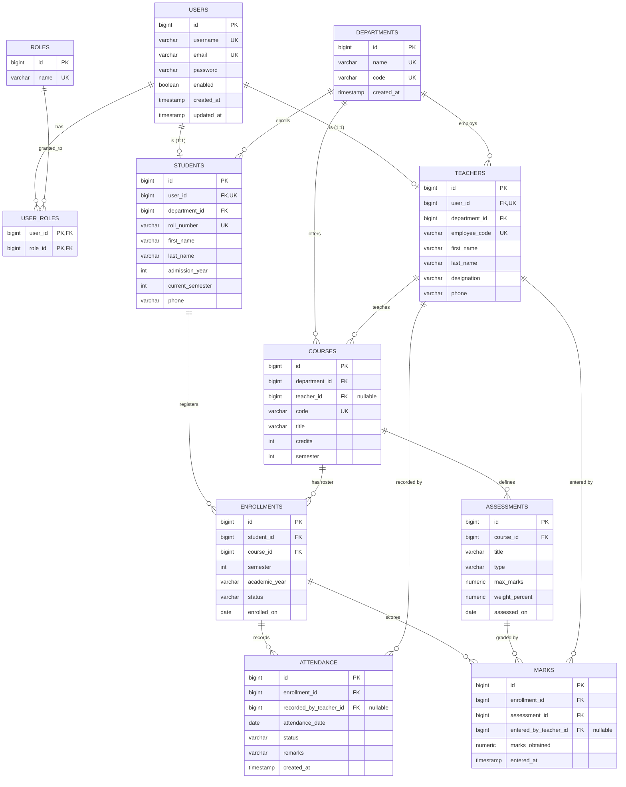

# Entity–Relationship Diagram & Schema

**Group 8 — Student Academic Records & Attendance Management System**

## ER Diagram

## Key design decisions

**Enrollment is a first-class entity, not a join table.** The Student↔Course
relationship is many-to-many and carries its own data (semester, academic year,
status), and it *owns* attendance and marks. A plain join table cannot hold that.

**Attendance and marks attach to Enrollment, never to (student, course).** This
makes it structurally impossible to record attendance or a mark for a student who
is not enrolled — the foreign key alone enforces it.

**Transcript is NOT a table.** It is derived on demand from enrollments, marks and
the grade scale. Storing it would duplicate data that goes stale the moment a mark
is corrected.

**Grade is never stored.** Letter grade and grade points are always computed from
the percentage by `GradeUtil`, so they can never drift out of sync with the marks.

## Relationships and cardinality

| From | To | Cardinality |
|---|---|---|
| User ↔ Role | M:N (via user_roles) |
| User → Student / Teacher | 1:1 (optional) |
| Department → Student / Teacher / Course | 1:M |
| Teacher → Course | 1:M (nullable until assigned) |
| Student → Enrollment | 1:M |
| Course → Enrollment | 1:M |
| Enrollment → Attendance / Mark | 1:M |
| Course → Assessment | 1:M |
| Assessment → Mark | 1:M |

## Unique constraints (duplicate prevention)

| Table | Unique on |
|---|---|
| users | username; email |
| roles | name |
| departments | name; code |
| students | user_id; roll_number |
| teachers | user_id; employee_code |
| courses | code |
| enrollments | (student_id, course_id, semester, academic_year) |
| attendance | (enrollment_id, attendance_date) |
| assessments | (course_id, title) |
| marks | (enrollment_id, assessment_id) |

## Referential actions (enforced in the service layer)

Hibernate's schema generation does not emit `ON DELETE` clauses, so the referential
rules live in the services:

| Parent → Child | Action | Reason |
|---|---|---|
| Department → Student/Teacher/Course | RESTRICT (409) | protects academic structure |
| Course → Enrollment | RESTRICT (409) | protects other students' history |
| Student → Enrollment → Attendance/Mark | CASCADE | the student's own records |
| Enrollment → Attendance/Mark | CASCADE | owned wholly by the enrollment |
| Course → Assessment | CASCADE | assessment has no meaning without its course |
| Teacher → Course/Attendance/Mark | SET NULL | keep the record, lose attribution |

## Business rules not expressible in the schema

Enforced in services, returning HTTP 400:

1. `marks_obtained ≤ assessment.max_marks` (a CHECK cannot see the parent row)
2. Sum of assessment `weight_percent` per course ≤ 100 (a row check cannot see siblings)
3. A mark's enrollment and assessment must belong to the same course

## Indexes

Every foreign-key column plus the columns reports filter by:
`attendance(attendance_date)`, `enrollments(semester, academic_year)`,
`students(department_id, admission_year)`, `courses(department_id, teacher_id, semester)`.

## Grade scale

| Percentage | Grade | Points |
|---|---|---|
| 90–100 | A+ | 4.0 |
| 80–89 | A | 3.7 |
| 70–79 | B | 3.3 |
| 60–69 | C | 2.7 |
| 50–59 | D | 2.0 |
| < 50 | F | 0.0 |

`GPA = Σ(gradePoints × credits) / Σ(credits)`
